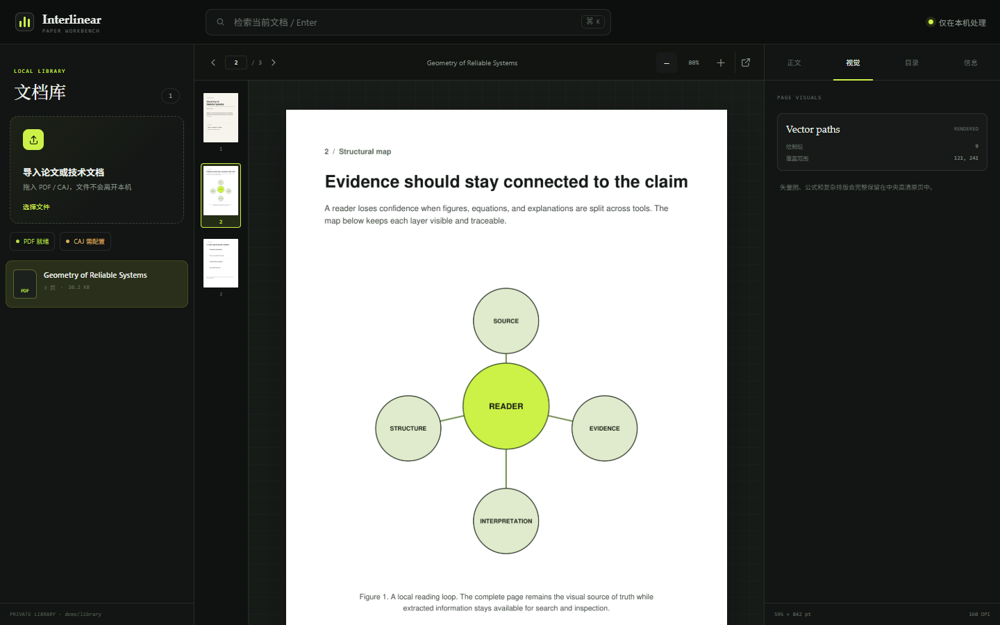

<p align="center">
  
</p>

<p align="center"><a href="https://github.com/BladeDancer743/Interlinear/actions/workflows/quality.yml"></a> <a href="interlinear/SKILL.md"></a> <a href="CHANGELOG.md"></a> <a href="LICENSE"></a></p>

# Interlinear

**让 AI 在英文技术论文原句旁，写下真正有用的中文夹注。**

Interlinear 是一个跨 agent 的论文阅读 skill。它识别缩写、符号、命名定理和“看似熟悉但语义特殊”的词，在不改写作者论证的前提下插入简短中文解释。

它首先服务量子计算论文，也能通过上下文发现机制处理物理、计算机科学和其他技术领域。

仓库同时提供终端 Skill 和完全本地的 Web 论文工作台，但两者是独立入口：安装或调用 Skill 不会启动 Web，启动 Web 也不会读取终端对话。

## 两个独立入口

| 入口 | 启动方式 | 负责 |
|:--|:--|:--|
| 终端 / 对话 Skill | 在 agent 中调用 `$interlinear` | 论文阅读、行间注释、术语表、逐节交付、Markdown 导出 |
| Web 工作台 | 显式运行 `python -m interlinear_web` | 高清原页、坐标高亮、注释卡片、自动排版、原生 PDF 批注导出 |

两个入口不会自动启动、读取或修改对方的状态。需要把终端注释带到
Web 时，由用户显式复制或重新创建。

## 30 秒看懂

原文：

> However, noise in quantum gates will limit the size of circuits that can be run reliably, unless quantum error correction is used.

Interlinear：

> However, noise in quantum gates【量子门噪声：实际操作偏离目标变换，使误差随电路累积】 will limit the size of circuits【量子电路：按依赖关系排列的量子操作序列】 that can be run reliably, unless quantum error correction【量子纠错：把逻辑信息编码到更大系统中，通过综合征检测并修正错误】 is used.

它做的不是全文机翻，而是保留英文阅读节奏，专门消除术语造成的认知中断。

## 为什么不是普通翻译

| 能力 | 全文翻译 | 通用总结 | Interlinear |
|:--|:--:|:--:|:--:|
| 保留原句和公式 | — | — | ✓ |
| 只解释真正阻碍理解的词 | — | — | ✓ |
| 根据读者水平控制密度 | — | — | ✓ |
| 统一缩写、全称与复现简注 | — | — | ✓ |
| 区分已验证、推断与待核信息 | — | — | ✓ |
| 提供定义式与几何直觉式解释 | — | — | ✓ |

## 两种解释模式

| 原词 | 定义式 | 几何直觉式 |
|:--|:--|:--|
| `quantum gate` | 作用于量子态的基本控制操作 | 在布洛赫球上精确旋转状态箭头 |
| `decoherence` | 系统与环境作用导致相干信息不可用 | 相位信息向环境泄漏，状态箭头逐渐缩短 |
| `Grover's algorithm` | 用振幅放大加速无结构搜索 | 状态在二维子空间中逐步旋向正确答案 |

几何模式会明确标记类比边界，不用“听起来直观但物理上错误”的故事换取易懂。

## 工作方式


- **三档读者水平**：`basic`、`intermediate`、`advanced`
- **两种解释风格**：定义式、几何直觉式
- **终端四种交付方式**：行间注释、术语表、逐节阅读、Markdown 导出
- **64 个量子术语族**：以源码实际可验证数量为准
- **渐进加载**：只在需要时加载论文获取、注释规则、几何直觉或量子术语参考
- **机器质量门禁**：自动检查原文保真、夹注格式、密度与统计一致性

## 终端 Skill 安装

### 推荐：Skills CLI

使用开放的 [`skills`](https://github.com/vercel-labs/skills) CLI 自动发现仓库中的 `interlinear` skill：

```bash
npx skills add BladeDancer743/Interlinear --skill interlinear -g
```

只安装到指定 agent：

```bash
npx skills add BladeDancer743/Interlinear --skill interlinear -g -a codex
npx skills add BladeDancer743/Interlinear --skill interlinear -g -a claude-code
npx skills add BladeDancer743/Interlinear --skill interlinear -g -a opencode
```

### 手动安装

复制 [`interlinear/`](interlinear/) 整个目录到对应 agent 的 skills 目录，并保持目录名为 `interlinear`。

## 终端 / 对话端使用

直接给论文、章节或片段：

```text
用 $interlinear 通读这篇论文，按 intermediate 难度给摘要和引言加定义式夹注：
https://arxiv.org/abs/1801.00862
```

```text
用 $interlinear 解释 §2，只注释阻碍理解的术语；量子门和纠错码使用几何直觉模式。
```

```text
用 $interlinear 检查这段注释有没有误导性的物理类比，并给出修正版。
```

长论文默认先建立 thesis map，再逐节交付；不会为了“全文处理”把整个 PDF 粗暴塞进一次上下文。

## Web 端：本地论文工作台

Web 工作台属于独立应用层，必须显式启动，不会增加 agent 每次调用
Skill 时的上下文负担，也不会读取终端会话。它默认只监听
`127.0.0.1`，页面渲染、文本提取、全文搜索与文件缓存都在本机完成。

<p align="center">
  
</p>

```text
本地文档库 → 高清原页 + 页面缩略图
          ├→ 可检索正文
          ├→ 坐标高亮 + 中文注释
          ├→ 自适应页边 / 聚焦 / 列表排版
          ├→ PDF 目录与元数据
          └→ 嵌入位图与矢量绘制信息
```

先克隆完整仓库，然后启动：

```bash
python -m venv .venv
python -m pip install -r requirements-web.txt
python -m interlinear_web --open
```

Windows PowerShell 也可以直接使用虚拟环境中的 Python：

```powershell
.\.venv\Scripts\python.exe -m pip install -r requirements-web.txt
.\.venv\Scripts\python.exe -m interlinear_web --open
```

浏览器会打开 `http://127.0.0.1:8765`。导入后的文件和渲染缓存保存在 Git 忽略的 `.interlinear-web/`，不会上传到任何远程服务。

### 插入注释与自动排版

在右侧“正文”中选择一段连续原文，点击“选中后加注”，写入中文解释并选择已核实、推断或待核状态。工作台会把选区映射回 PDF 坐标，并使用稳定编号关联原文与注释卡。

自动排版决策器会在页面缩放或窗口变化后重新判断：

- **页边**：空间充足、注释不密集时，全部卡片沿页边避碰展开；
- **聚焦**：页边空间有限时，保留所有锚点，只展开当前注释；
- **列表**：窄屏、长注释或高密度页面，把注释放在页面下方。

工具栏可以覆盖自动选择。下载按钮会生成一份新的 PDF，使用标准高亮与评论批注，不会修改导入的原文件。

### PDF 与 CAJ 边界

- **PDF**：内置支持。可按 72–300 DPI 查看完整原页，提取正文、目录、链接数、嵌入位图和矢量绘制信息，并导出标准高亮/评论批注。
- **CAJ**：界面可直接接收，但转换由本机可用的 `caj2pdf` 或用户指定转换器完成。
- **CAJ 变体**：CAJ/HN 等内部格式兼容性并不统一；转换失败时，工作台会显示真实错误，不会假装已经解析。
- **保底路径**：可在 CAJViewer 中使用“打印为 PDF”，再把 PDF 导入工作台。

如果 `caj2pdf` 不在 `PATH`，可以用一个不经过 shell 执行的命令模板指定转换器：

```powershell
$env:INTERLINEAR_CAJ_COMMAND = 'caj2pdf convert {input} -o {output}'
.\.venv\Scripts\python.exe -m interlinear_web --open
```

详细的接口、存储与安全说明见 [本地工作台文档](docs/web-workbench.md)。

### 校验导出的注释

把精确原文保存为 `source.txt`，并按 Skill 约定在导出稿中加入不可见的
source markers，然后运行：

```bash
python interlinear/scripts/validate_annotation.py \
  source.txt annotated.md --require-summary
```

校验器会在移除 `【…】` 后比对原文，同时检查括号、夹注格式、公式/代码保护、
单句密度和节尾统计。它是零依赖脚本，随 Skill 一起安装。

## v4.3 的结构

```text
Interlinear/
├── interlinear/                    # 可安装 skill
│   ├── SKILL.md                    # 202 行核心工作流
│   ├── agents/openai.yaml          # Codex UI 元数据
│   ├── scripts/
│   │   └── validate_annotation.py  # 注释稿机器验收
│   └── references/
│       ├── annotation-policy.md
│       ├── geometric-intuition.md
│       ├── paper-acquisition.md
│       └── quantum-terminology.md
├── interlinear_web/                # 本地 PDF / CAJ 论文工作台
│   ├── app.py                      # 本地 API 与静态界面
│   ├── store.py                    # 私有文档库、提取、注释与渲染
│   ├── caj.py                      # 可选 CAJ 转换器适配层
│   └── static/                     # 离线前端
├── scripts/validate_skill.py       # 结构、链接、隐私与指标校验
├── tests/                          # Skill、PDF、CAJ 与 API 回归测试
├── docs/
│   ├── annotation-layout.md        # Web 专属排版决策
│   └── ...                         # 设计、评测与扩展文档
└── .github/                        # CI 与社区协作入口
```

核心 [`SKILL.md`](interlinear/SKILL.md) 保持短小；详细知识按任务加载，避免每次调用都占用整份术语库。

## 质量边界

Interlinear 会：

- 保留公式、符号、引用编号和作者原意；
- 优先使用论文自身定义与权威来源；
- 对未核实内容标记 `⚠️推断` 或 `🔍待核`；
- 区分几何类比与真实物理机制；
- 控制注释密度并进行二次遗漏扫描。
- 对导出稿执行可复现的原文保真与输出契约校验。

Interlinear 不会：

- 调用终端 Skill 时自动启动 Web 服务；
- 启动 Web 时读取或修改终端对话状态；
- 绕过付费墙；
- 把抓取到的受版权保护论文全文重新发布；
- 把逻辑量子比特描述为“无错”；
- 暗示纠缠可以超光速通信；
- 用虚假的术语数量或能力指标包装项目。

## 项目状态

`v4.3.0` 加入了坐标锚定注释、原生 PDF 批注导出和自适应排版决策器，并明确隔离终端 Skill 与 Web 工作台的启动、依赖和状态边界。

当前重点：

- 增加可选 OCR，为纯扫描 PDF 提供正文识别；
- 扩大不同 CAJ 内部变体的兼容性测试；
- 增加可复现的论文片段评测集；
- 扩充量子之外的领域 reference；
- 对术语翻译和几何类比建立来源审查；
- 收集 Claude Code、Codex 与 OpenCode 的实际调用反馈。

## 文档

- [设计与架构](docs/architecture.md)
- [本地论文工作台](docs/web-workbench.md)
- [Web 注释排版](docs/annotation-layout.md)
- [评测方法](docs/evaluation.md)
- [扩展新领域](docs/extending-domains.md)
- [发布流程](docs/releasing.md)
- [变更记录](CHANGELOG.md)

## 参与贡献

术语修正、误导性类比、漏注案例和新领域词表都很有价值。提交前请阅读 [CONTRIBUTING.md](CONTRIBUTING.md)。

安全或隐私问题请查看 [SECURITY.md](SECURITY.md)，社区行为规范见 [CODE_OF_CONDUCT.md](CODE_OF_CONDUCT.md)。

## License

[MIT](LICENSE)
