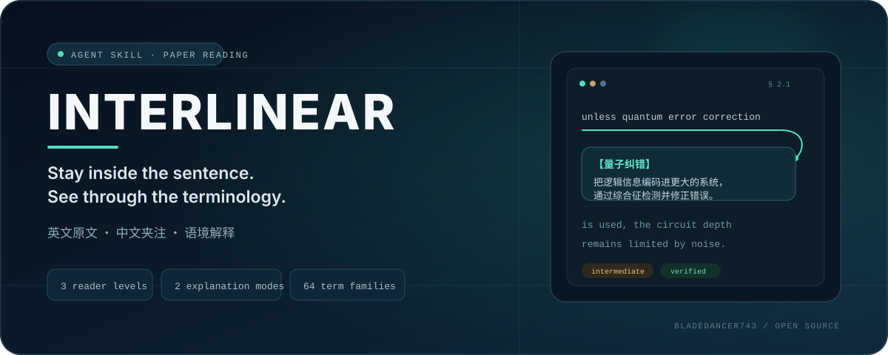

<p align="center">
  
</p>

<p align="center"><a href="https://github.com/BladeDancer743/Interlinear/actions/workflows/quality.yml"></a> <a href="interlinear/SKILL.md"></a> <a href="CHANGELOG.md"></a> <a href="LICENSE"></a></p>

# Interlinear

**让 AI 在英文技术论文原句旁，写下真正有用的中文夹注。**

Interlinear 是一个跨 agent 的论文阅读 skill。它识别缩写、符号、命名定理和“看似熟悉但语义特殊”的词，在不改写作者论证的前提下插入简短中文解释。

它首先服务量子计算论文，也能通过上下文发现机制处理物理、计算机科学和其他技术领域。

## 30 秒看懂

原文：

> However, noise in quantum gates will limit the size of circuits that can be run reliably, unless quantum error correction is used.

Interlinear：

> However, noise in quantum gates【量子门噪声：实际操作偏离目标变换，使误差随电路累积】 will limit the size of circuits【量子电路：按依赖关系排列的量子操作序列】 that can be run reliably, unless quantum error correction【量子纠错：把逻辑信息编码到更大系统中，通过综合征检测并修正错误】 is used.

它做的不是全文机翻，而是保留英文阅读节奏，专门消除术语造成的认知中断。

## 为什么不是普通翻译

| 能力 | 全文翻译 | 通用总结 | Interlinear |
|:--|:--:|:--:|:--:|
| 保留原句和公式 | — | — | ✓ |
| 只解释真正阻碍理解的词 | — | — | ✓ |
| 根据读者水平控制密度 | — | — | ✓ |
| 统一缩写、全称与复现简注 | — | — | ✓ |
| 区分已验证、推断与待核信息 | — | — | ✓ |
| 提供定义式与几何直觉式解释 | — | — | ✓ |

## 两种解释模式

| 原词 | 定义式 | 几何直觉式 |
|:--|:--|:--|
| `quantum gate` | 作用于量子态的基本控制操作 | 在布洛赫球上精确旋转状态箭头 |
| `decoherence` | 系统与环境作用导致相干信息不可用 | 相位信息向环境泄漏，状态箭头逐渐缩短 |
| `Grover's algorithm` | 用振幅放大加速无结构搜索 | 状态在二维子空间中逐步旋向正确答案 |

几何模式会明确标记类比边界，不用“听起来直观但物理上错误”的故事换取易懂。

## 工作方式


- **三档读者水平**：`basic`、`intermediate`、`advanced`
- **两种解释风格**：定义式、几何直觉式
- **四种交付方式**：行间注释、术语表、逐节阅读、Markdown 导出
- **64 个量子术语族**：以源码实际可验证数量为准
- **渐进加载**：只在需要时加载论文获取、注释规则、几何直觉或量子术语参考

## 安装

### 推荐：Skills CLI

使用开放的 [`skills`](https://github.com/vercel-labs/skills) CLI 自动发现仓库中的 `interlinear` skill：

```bash
npx skills add BladeDancer743/Interlinear --skill interlinear -g
```

只安装到指定 agent：

```bash
npx skills add BladeDancer743/Interlinear --skill interlinear -g -a codex
npx skills add BladeDancer743/Interlinear --skill interlinear -g -a claude-code
npx skills add BladeDancer743/Interlinear --skill interlinear -g -a opencode
```

### 手动安装

复制 [`interlinear/`](interlinear/) 整个目录到对应 agent 的 skills 目录，并保持目录名为 `interlinear`。

## 使用

直接给论文、章节或片段：

```text
用 $interlinear 通读这篇论文，按 intermediate 难度给摘要和引言加定义式夹注：
https://arxiv.org/abs/1801.00862
```

```text
用 $interlinear 解释 §2，只注释阻碍理解的术语；量子门和纠错码使用几何直觉模式。
```

```text
用 $interlinear 检查这段注释有没有误导性的物理类比，并给出修正版。
```

长论文默认先建立 thesis map，再逐节交付；不会为了“全文处理”把整个 PDF 粗暴塞进一次上下文。

## v4 的结构

```text
Interlinear/
├── interlinear/                    # 可安装 skill
│   ├── SKILL.md                    # 164 行核心工作流
│   ├── agents/openai.yaml          # Codex UI 元数据
│   └── references/
│       ├── annotation-policy.md
│       ├── geometric-intuition.md
│       ├── paper-acquisition.md
│       └── quantum-terminology.md
├── scripts/validate_skill.py       # 结构、链接、隐私与指标校验
├── docs/                           # 设计、评测与扩展文档
└── .github/                        # CI 与社区协作入口
```

核心 [`SKILL.md`](interlinear/SKILL.md) 保持短小；详细知识按任务加载，避免每次调用都占用整份术语库。

## 质量边界

Interlinear 会：

- 保留公式、符号、引用编号和作者原意；
- 优先使用论文自身定义与权威来源；
- 对未核实内容标记 `⚠️推断` 或 `🔍待核`；
- 区分几何类比与真实物理机制；
- 控制注释密度并进行二次遗漏扫描。

Interlinear 不会：

- 绕过付费墙；
- 把抓取到的受版权保护论文全文重新发布；
- 把逻辑量子比特描述为“无错”；
- 暗示纠缠可以超光速通信；
- 用虚假的术语数量或能力指标包装项目。

## 项目状态

`v4.0.0` 是一次结构升级：skill 已适配跨 agent 发现规范并通过自动校验，但真实论文覆盖仍在持续扩大。

当前重点：

- 增加可复现的论文片段评测集；
- 扩充量子之外的领域 reference；
- 对术语翻译和几何类比建立来源审查；
- 收集 Claude Code、Codex 与 OpenCode 的实际调用反馈。

## 文档

- [设计与架构](docs/architecture.md)
- [评测方法](docs/evaluation.md)
- [扩展新领域](docs/extending-domains.md)
- [发布流程](docs/releasing.md)
- [变更记录](CHANGELOG.md)

## 参与贡献

术语修正、误导性类比、漏注案例和新领域词表都很有价值。提交前请阅读 [CONTRIBUTING.md](CONTRIBUTING.md)。

安全或隐私问题请查看 [SECURITY.md](SECURITY.md)，社区行为规范见 [CODE_OF_CONDUCT.md](CODE_OF_CONDUCT.md)。

## License

[MIT](LICENSE)
