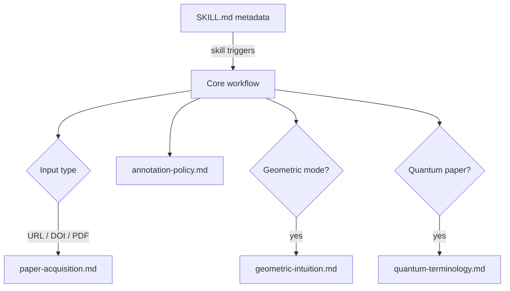

# Architecture

Interlinear separates the agent's always-loaded decision process from domain material that is needed only for some papers.

## Design goals

1. Preserve the source argument and notation.
2. Spend context on the current paper, not on unused terminology.
3. Make uncertainty visible.
4. Keep explanation density controllable.
5. Remain portable across agent runtimes.

## Progressive loading

The core skill stays below 500 lines. References are one hop away and have explicit routing rules in `SKILL.md`.

## Processing pipeline

| Stage | Input | Output |
|:--|:--|:--|
| Source inspection | File, URL, DOI, or excerpt | Verified source record |
| Reading map | Abstract and relevant context | Thesis and section role |
| Candidate discovery | Current section | Terms, symbols, acronyms, named results |
| Selection | Candidates + reader level | Ranked annotation set |
| Verification | Paper, references, primary sources | Explanation + confidence |
| Injection | Source passage + explanations | Preserved text with inline notes |
| Quality pass | Annotated section | Consistency and omission report |

## Trust model

Interlinear distinguishes:

- **verified**: supported by the paper, bundled reference, or authoritative source;
- **inferred**: plausible from context but not externally confirmed;
- **needs verification**: ambiguous or source-dependent.

Confidence is attached to the annotation, not hidden in internal reasoning.

## Compatibility

The installable skill is the [`interlinear/`](../interlinear/) directory. It uses only the shared `name` and `description` frontmatter fields. Runtime-specific UI metadata lives in `interlinear/agents/openai.yaml` and does not alter the portable skill contract.

## Repository boundary

User-facing documentation, CI, governance, and release notes stay outside the installable skill directory. This keeps the installed context focused while allowing the GitHub repository to remain understandable and maintainable.
