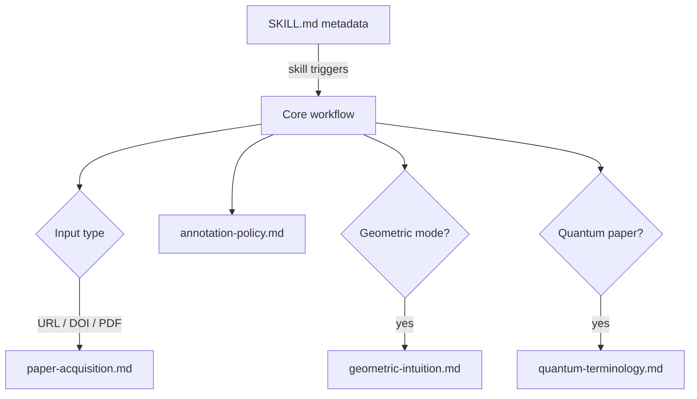
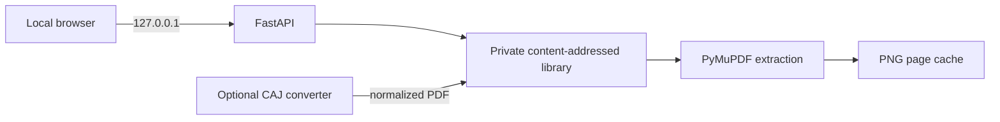

# Architecture

Interlinear separates the agent's always-loaded decision process from domain material that is needed only for some papers and from the optional local application.

## Design goals

1. Preserve the source argument and notation.
2. Spend context on the current paper, not on unused terminology.
3. Make uncertainty visible.
4. Keep explanation density controllable.
5. Remain portable across agent runtimes.
6. Keep private papers and page renders on the reader's machine.

## Progressive loading

The core skill stays below 500 lines. References are one hop away and have explicit routing rules in `SKILL.md`.

## Processing pipeline

| Stage | Input | Output |
|:--|:--|:--|
| Source inspection | File, URL, DOI, or excerpt | Verified source record |
| Reading map | Abstract and relevant context | Thesis and section role |
| Candidate discovery | Current section | Terms, symbols, acronyms, named results |
| Selection | Candidates + reader level | Ranked annotation set |
| Verification | Paper, references, primary sources | Explanation + confidence |
| Injection | Source passage + explanations | Preserved text with inline notes |
| Machine validation | Source + annotated unit | Fidelity and output-contract report |
| Quality pass | Annotated section | Consistency and omission report |

## Trust model

Interlinear distinguishes:

- **verified**: supported by the paper, bundled reference, or authoritative source;
- **inferred**: plausible from context but not externally confirmed;
- **needs verification**: ambiguous or source-dependent.

Confidence is attached to the annotation, not hidden in internal reasoning.

## Compatibility

The installable skill is the [`interlinear/`](../interlinear/) directory. It uses only the shared `name` and `description` frontmatter fields. Runtime-specific UI metadata lives in `interlinear/agents/openai.yaml` and does not alter the portable skill contract.

## Application layer

The optional [`interlinear_web/`](../interlinear_web/) package is deliberately
outside the installable Skill:

The browser never receives a remote asset dependency. FastAPI serves the UI,
document metadata, page text, search results, and page images from the same
local origin. PyMuPDF opens a fresh document handle per operation so requests
do not share mutable PDF state.

CAJ conversion is an explicit adapter boundary because CAJ is proprietary and
has incompatible internal variants. A configured command is tokenized and
executed without a shell. Its output must exist and begin with a PDF signature
before it enters the normal PDF pipeline.

## Repository boundary

User-facing documentation, CI, governance, and release notes stay outside the installable skill directory. This keeps the installed context focused while allowing the GitHub repository to remain understandable and maintainable.
